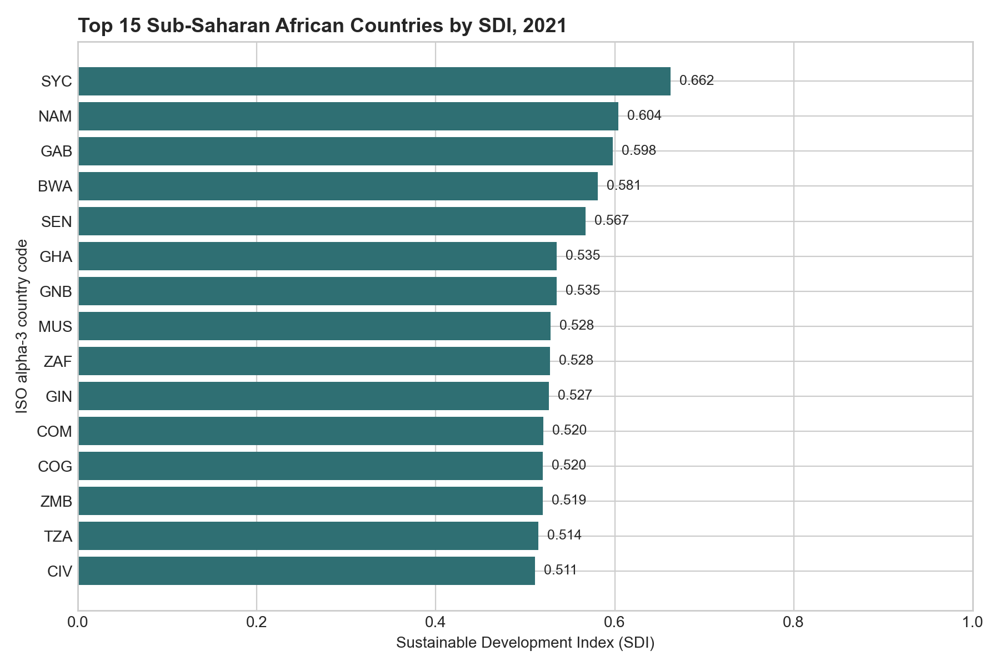
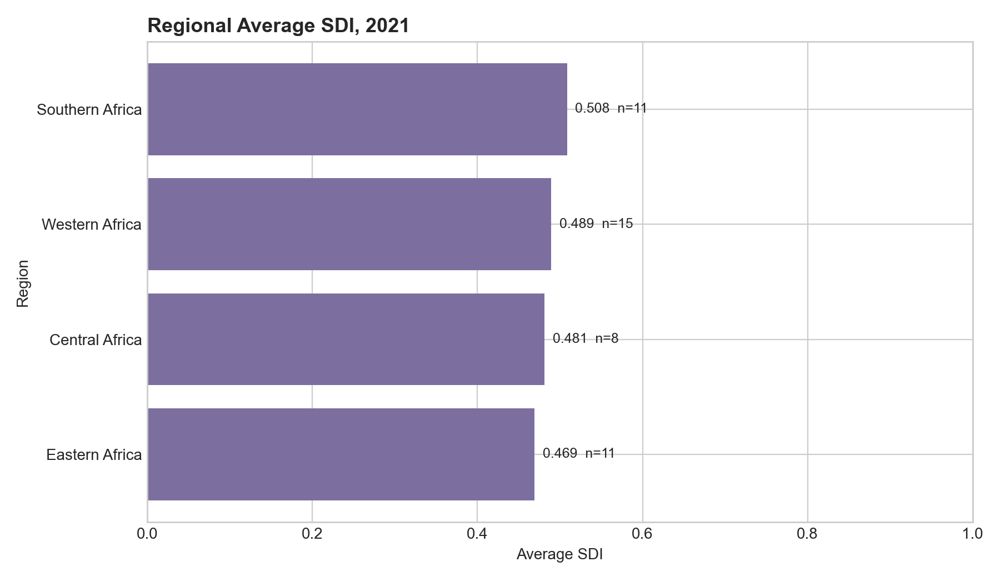
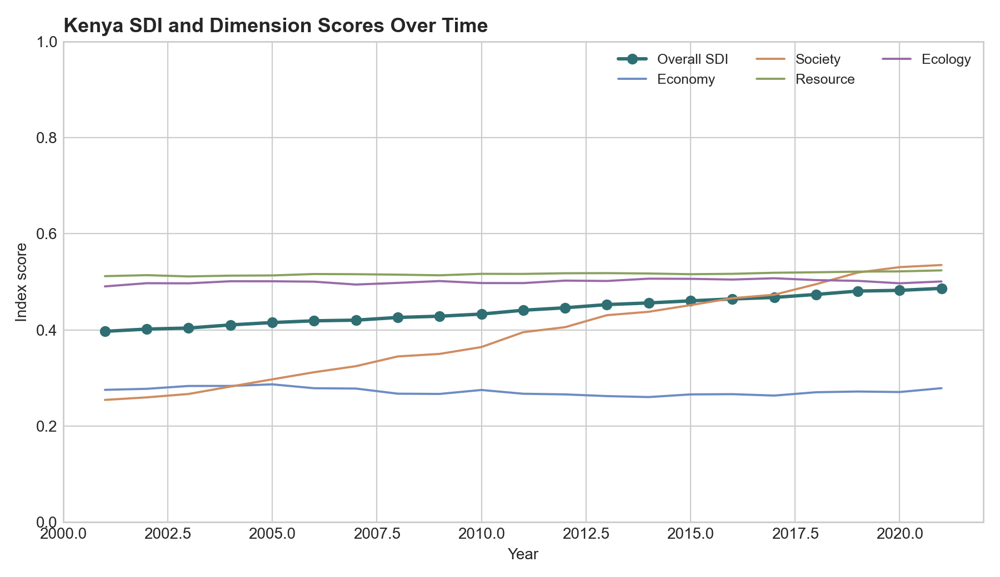

# Sub-Saharan Africa Sustainable Development Indicator Analysis

This small portfolio project demonstrates how a research dataset can be queried, summarised, and translated into policy-facing evidence using SQL and basic data visualisation.

The dataset comes from my doctoral research on foreign direct investment and sustainable development in Sub-Saharan Africa. It contains country-year indicators and a composite Sustainable Development Index (SDI) with four dimensions: economy, society, resource, and ecology.

## Project Questions

1. Which Sub-Saharan African countries had the highest SDI scores in the latest available year?
2. How do regional average SDI scores compare?
3. How did one country, Kenya, change across the overall SDI and its four dimensions over time?

## Data

- Source file: `index_data.csv`
- Coverage: 945 country-year observations
- Latest available year: 2021
- Latest-year country coverage: 45 countries
- Key fields: `SDI`, `SDI_Economy`, `SDI_Society`, `SDI_Resource`, `SDI_Ecology`, `Region`

## Methods

- Used SQLite-style SQL queries to inspect, filter, aggregate, and rank the dataset.
- Exported query outputs as CSV files for reproducibility.
- Created simple static charts to communicate the main findings.

## Selected Outputs

### Top Countries by SDI, 2021



The latest available year in the dataset is 2021. Seychelles (`SYC`) had the highest SDI score among the 45 countries covered in that year, followed by Namibia (`NAM`), Gabon (`GAB`), Botswana (`BWA`), and Senegal (`SEN`).

### Regional Average SDI, 2021



The regional comparison summarises variation across broad Sub-Saharan African regions. This type of view is useful for quickly identifying where a policy or donor report may need more detailed country-level interpretation.

### Kenya SDI Trend



The country trend view shows how the overall SDI and its four dimensions can be tracked over time. This format can be adapted for country briefs, donor reporting, monitoring and evaluation outputs, or higher-education data storytelling.

## Files

- `data/index_data.csv`: Working dataset used in this portfolio example.
- `queries.sql`: SQL queries used for inspection, ranking, aggregation, and country trend extraction.
- `scripts/make_outputs.py`: Python script used to regenerate the CSV outputs and figures.
- `outputs/latest_year_top15_sdi.csv`: Top 15 countries by SDI in the latest available year.
- `outputs/latest_year_regional_average_sdi.csv`: Regional average SDI and dimension scores.
- `outputs/kenya_sdi_trend.csv`: Kenya time-series output.
- `figures/`: Exported charts for portfolio use.

## How to Reproduce

1. Import `data/index_data.csv` into SQLite or DB Browser for SQLite as a table named `index_data`.
2. Run the queries in `queries.sql`.
3. To regenerate the CSV outputs and figures, run:

```bash
python scripts/make_outputs.py
```

## Skills Demonstrated

- SQL querying with a real research dataset
- Data cleaning awareness and variable selection
- Indicator-based analysis
- Ranking and regional aggregation
- Country trend analysis
- Policy-facing data communication

## Portfolio Summary

This project shows my ability to turn a complex country-year indicator dataset into clear analytical outputs that can support research, monitoring and evaluation, strategic planning, and donor-facing reporting.
